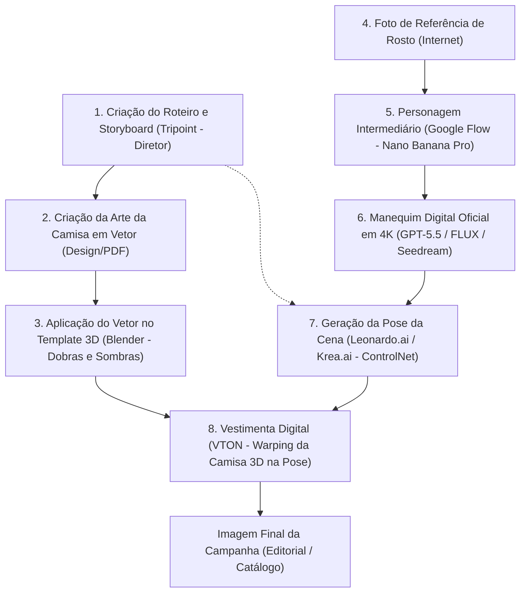

# 📍 Protocolo de Passagem de Bastão (Handover) — AVA Sem Limites

Este documento é a nossa âncora de persistência para as sessões de planejamento e codificação. Ele deve ser atualizado ao final de cada sessão e lido no início da próxima.

---

## 1. O que realizamos nesta sessão (Estado Atual)

*   **Pitch Deck Completo (12 Slides) ✅:**
    *   Gerados 12 slides individuais em formato JPEG (`1366x768` para encaixe nativo em tela cheia do notebook do usuário) na pasta `/public/imagens/SLIDES/`.
    *   Visual: Tema escuro puro (`#000000`), fontes Poppins 200 (ExtraLight) para textos técnicos e Brave Ember para títulos dramáticos de impacto.
    *   Semântica Comercial: Excluída qualquer conotação de "luxo" (substituída por moda criativa, autêntica e atitude de rua).
    *   **Compilação em PDF:** Criado e executado o script [/scripts/compile_pdf.py](file:///home/artz/Documentos/Antigravity/Ava-Vitoria/scripts/compile_pdf.py) que unificou os 12 JPEGs em um único arquivo PDF premium: [apresentacao_ava.pdf](file:///home/artz/Documentos/Antigravity/Ava-Vitoria/public/imagens/SLIDES/apresentacao_ava.pdf).
*   **Guias de Integração com Redes Sociais ✅:**
    *   **Instagram:** Revisado o passo a passo comercial e técnico [Sacolinha do Instagram.pdf](file:///home/artz/Documentos/Antigravity/Ava-Vitoria/public/imagens/SLIDES/Sacolinha%20do%20Instagram.pdf) que aponta para o nosso catálogo PostgreSQL dinâmico em `https://www.avasemlimites.com.br/api/catalog/meta`.
    *   **TikTok:** Criado o documento [Guia de Integracao com TikTok.md](file:///home/artz/Documentos/Antigravity/Ava-Vitoria/public/imagens/SLIDES/Guia%20de%20Integracao%20com%20TikTok.md) detalhando Pixel, Business Center, Catalog Feeds e Shopping Ads (linguagem de storytelling de vídeo).
*   **Esteira de Personagens VTON (Rascunho de Base) ✅:**
    *   Desenvolvida a biblioteca conceitual dos 6 manequins no Google Flow (Nano Banana Pro) sob o mesmo padrão de estúdio (fundo cinza, camiseta branca, jeans, pose neutra com braços afastados):
        *   **Menino:** Finalizado na versão 4K nítida local ([Menino_base_4k.jpg](file:///home/artz/Documentos/Antigravity/Ava-Vitoria/public/referencias/Menino/Menino_base_4k.jpg)).
        *   **Menina:** Finalizada sem sorrir na versão 4K nítida local ([Menina_base_4k.jpg](file:///home/artz/Documentos/Antigravity/Ava-Vitoria/public/referencias/Menina/Menina_base_4k.jpg)).
        *   **Moço:** Primeiro intermediário aprovado com dreadlocks e tatuagens.
        *   **Moça, Senhor, Senhora:** Prompts rascunhados em inglês e validados.
    *   **Script de Nitidez Local:** Executado o script [/scripts/sharp_characters.py](file:///home/artz/Documentos/Antigravity/Ava-Vitoria/scripts/sharp_characters.py) que aplica *Unsharp Masking* e ajuste leve de contraste nas imagens geradas em baixa densidade na nuvem, gerando texturas super nítidas no computador local.

---

## 2. ⚙️ Fluxograma do Processo Operacional (Mapeamento de Processos)

O próximo Lincoln deve compreender e seguir a seguinte esteira integrada para a geração final de imagens editoriais e de catálogo:

### Detalhamento das Etapas:
1.  **Roteiro & Storyboard:** O sócio-diretor desenha os enquadramentos e a sequência narrativa.
2.  **Vetor da Arte:** A estampa técnica limpa.
3.  **Render da Camisa (Blender):** Criação do mockup da camiseta física (com dobras, costuras e caimento real) onde o vetor é aplicado digitalmente, gerando a imagem da peça plana para VTON.
4.  **Referência de Rosto:** Imagens conceituais baixadas da internet.
5.  **Intermediário (Google Flow):** Geração do personagem de frente com camiseta branca e jeans no Nano Banana Pro (0 créditos) para fixar a fisionomia inicial.
6.  **Manequim 4K:** Processamento do intermediário em IAs premium (GPT-5.5, FLUX Dev/Pro ou Seedream com Image-to-Image / Denoising em 0.25) para consolidar a textura dos poros, cabelo definido e tatuagens na resolução máxima.
7.  **Pose da Cena:** O Manequim 4K frontal (Etapa 6) é submetido ao ControlNet (Scribble/Lineart ou OpenPose) guiado pelo storyboard do Diretor (Etapa 1), gerando o modelo na pose correta da cena (ex: agachado, correndo).
8.  **VTON:** A IA de provador virtual funde a peça 3D plana do Blender (Etapa 3) com o corpo do modelo na pose correta (Etapa 7) para o catálogo ou carrossel do site.

---

## 3. Próximos Passos Imediatos (Pós-Reunião)

1.  Aguardar o feedback da reunião com o **Tripoint Ava** (marcada para amanhã, 14:00, em Vitória).
2.  Iniciar o refinamento dos 6 personagens no GPT-5.5 / FLUX para gerar as imagens de base oficiais em 4K.
3.  Apoiar na estruturação do ambiente do **Blender** para modelagem física das camisetas e exportação das peças planas de vestuário.
